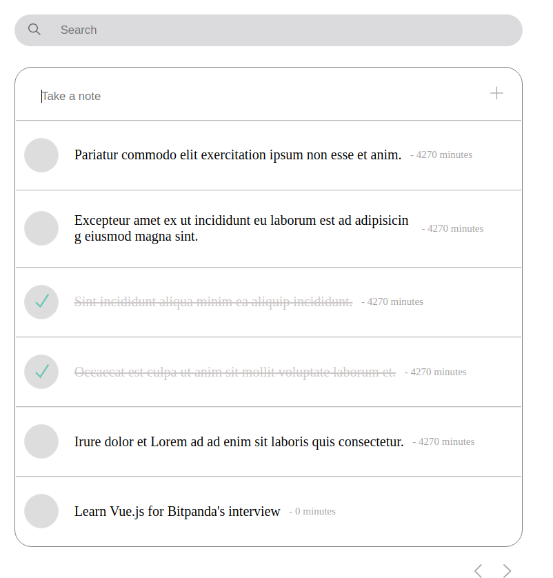

# BitPanda Interview tasks

In this document I will describe all the procedures before developing any code and also how the code was written with Pull Requests and testing each of the features.

## Demo

## Objective

To create a TODO MVC application with the requirements provided in:

Design: [figma link](https://www.figma.com/file/0zmN3IdInAR8aUGdrQ1w61/html%2Bcss-challenge?node-id=0%3A1)

Backend: [todo-bitpanda-server](./server/README.md)

Requirements:

- Typescript
- Vue Composition API
- Pug
- BEM methodology
- Responsive, use Flexbox (no media queries 🙂)
- Relative CSS units
- CSS/SCSS variables where applicable

## Procedure

Before writting any code I saw the requirements of the application in which I noticed there were several tasks and were split in the following **tickets**. Each of them has a different pull request associated and also is split in a different branch, at any point you may check each of the branches to see that particular feature

- Basic Interface Creation (Todo List and Todo Item)
- Connection with the backend (in order to extract the todolist and execute REST operations)
- Todo List Feature: Create a new todo
- Todo List Feature: Delete a todo
- Todo List Feature: Fetch all todos
- Todo List Feature: Update a todo with the current status
- Todo List Feature: Pagination
- Testing

Every "small feature" was developed in a separated pull request with the commits associated to it. This is a common practice I follow, afterwards someone reviews my PR or do a Pair Programming exercise to ensure the quality and coding standards of the feature being developed.

## Who reviewed my PR's ?

My friend's dog was in charge with the mission of reviewing my PRs in exchange for treats.

## Demo usage

### Fetching

When the backend is running, it will fetch all the todo tasks

### Create a new

At the top corner there is a "Take note". Users are able to write a note and it will display at the bottom

After writting you can see there is a new todo task which is **Learn Vue.js for Bitpanda's interview**

### Delete a task

Each of the items, on hover have a cross sign. Users are able to perform this action to delete a todo task and it will get deleted in the backend.

In this case I have erased every task but two, which is one that was already written and the one to learn Vue.js for Bitpanda's interview.

### Update a task

Users are able to update a task either as complete or incomplete. Users are able to click on the circle on the left to perform this.

Users are able to do this in the frontend and the backend will get updated.

### Pagination

Users are able to scroll through pages

### Searching

Users are able to search for a todo task

## Additional UI testing

I have used the tool Polypane in order to ensure every browser is working correctly.

## What did I learn?

Previously, I have only worked with React and other frameworks, this was the first time I have written code in Vue.js and I have always been eager to learn it, this was an excellent opportunity to do so :)

## What can be done next?

Many things! While my mind comes with many additional features we could build such as sorting, adding a priority to each task or even make it collaborative.

The first thing will always to validate that the product is useful for our end clients, in this case someone uses the Todo website.

Once this, we can discuss with the users and validate which are the next features to be developed and possibly add support for other frameworks like Algolia (Improving the search).
